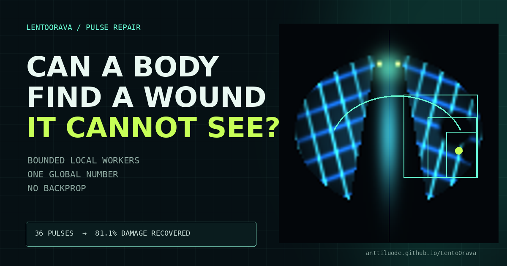

# LentoOrava — bounded observers make one image

**Flying squirrel conservation program. Sol thinking repo.**

[](https://anttiluode.github.io/LentoOrava/)

## [Launch the live Pulse Repair experiment →](https://anttiluode.github.io/LentoOrava/)

Cut a digital organism in the browser. Its repairers receive 6×6 local patches,
local write access, and **one scalar global health pulse**—never the wound map or
a gradient. Reversible hierarchical probes localize useful interventions; mobile
observers then carry intact information from the opposite side to the wound.

The page is static, dependency-free, and runs entirely on-device. You can also
load your own image; its left half becomes a bilateral repair blueprint and the
file never leaves the browser.

`LentoOrava` asks one concrete question:

> **Can a bounded observer capture a local fact and cause the corresponding fact to appear somewhere distant?**

The system has one causally shared latent field and a sparse population of local observer-writers. No observer receives global pooling, global attention, a flattened image, or the final target. Each has only:

```text
local patch
+ current address
+ private recurrent state
```

and can make only a local write.

The final RGB readout is deliberately a **1x1 decoder**, so it cannot repair long-range geometry after the observers finish.

## The machine

```text
partially observed image
        |
        v
pointwise input projection
        |
        v
+---------------- shared latent field X_t ----------------+
|                                                          |
|        local transport                                   |
|              |                                           |
|    local READ -> private state -> move -> local WRITE     |
|        ^                                      |          |
|        +--------------------------------------+          |
|                                                          |
+----------------------------------------------------------+
        |
        v
pointwise RGB decoder
        |
        v
one global image
```

The global state never has to be globally observed. It only has to be **causally shared**.

# Pulse Repair — global consequence returns to local actors

The single-pixel-camera seam closes the loop in the opposite direction:

```text
bounded local READ
        ↓
private state carries a fact
        ↓
distant local WRITE changes the body
        ↓
one scalar global consequence pulse
        ↓
active addressed probes localize the next useful WRITE
```

For a reversible trial write `W_k` at a known address:

```text
Δp_k = P(X + εW_k) - P(X)
```

The unknown “pixels” are now local causal contributions rather than brightness.
The live demo uses adaptive binary region masks to find compact damage without
handing search the target, spatial error, or autograd.

## Executed scalar-only fault assay

The controlled assay uses a known bilateral local repair primitive: copy a
small intact patch from the opposite side. Across 512 deterministic trials with
one to three unseen wounds, 128 candidate tiles, five committed writes, and a
36-call scalar budget:

| method | mean damage recovered | scalar calls |
|---|---:|---:|
| **adaptive pulse search** | **81.09%** | 34.5 mean |
| equal-budget random probing | 26.28% | 36 |
| exhaustive 128-tile scan | 87.06% | 129 |

Adaptive beat random on **95.90%** of paired wounds. At 26.74% of the
exhaustive scan's calls, it recovered 93.15% as much damage.

- Human-readable receipt: [`results/PULSE_REPAIR.md`](results/PULSE_REPAIR.md)
- Machine-readable receipt: [`results/PULSE_REPAIR.json`](results/PULSE_REPAIR.json)
- Reproduction: [`experiments/pulse_repair_benchmark.py`](experiments/pulse_repair_benchmark.py)

Scope matters: this is sparse fault localization under a valid local repair
rule. It is **not** general image restoration, learned regeneration, or a claim
of biological credit assignment. It establishes the smaller useful mechanism:
addressed interventions plus a scalar outcome can identify where scarce local
action should go.

# Gate 0 — read, carry, write

The synthetic target contains two same-colour Gaussian blobs at the same vertical coordinate. The input exposes only the left blob. The corresponding right blob is absent.

Colour and y vary independently from sample to sample.

The intended causal chain is:

```text
local observer encounters source
             |
             v
      private state changes
             |
             v
      observer / signal travels
             |
             v
      distant local write changes
             |
             v
        final image changes
```

## Why the first Gate 0 run was not a pass

The original 12-epoch run produced:

| arm | hidden-right MSE |
|---|---:|
| ACTIVE | 0.007609 |
| FIXED | 0.008155 |
| TRANSPORT | 0.008480 |

That ordering looked encouraging, but the exact best constant-image attacker scores **0.007520**. ACTIVE therefore had not solved the correspondence. Its broad vertical smear was consistent with an uncertainty-average solution.

There was also a second assay bug: under the old square start grid, the nearest initial observer lay 3.93–7.07 pixels from the source centre while its READ window was only 3x3. We were asking whether information could be carried before reliably letting a bounded observer acquire it.

See [`results/GATE0_DIAGNOSIS.md`](results/GATE0_DIAGNOSIS.md).

# Gate 0A — make the assay answerable

Gate 0A separates **capture**, **transport**, and **policy learning**.

## 1. Source rail

Observers now start along a vertical rail at the known source x coordinate and span the allowed y range.

This is not yet an active-search claim. It makes local fact acquisition a controlled precondition.

## 2. CARRIER positive control

A new `carrier` arm uses the exact same bounded READ, private GRU state, latent WRITE and 1x1 decoder as ACTIVE, but its x address is scripted to cross from the source rail to the target rail while preserving y.

| arm | local read | private state | movement | local write |
|---|---:|---:|---|---:|
| **CARRIER** | yes | yes | scripted source → target | yes |
| **ACTIVE** | yes | yes | learned | yes |
| **FIXED** | yes | yes | none | yes |
| **TRANSPORT** | no | no | none | no |

This gives the experiment a proper diagnosis:

```text
CARRIER fails
    -> the bounded read/carry/write body or objective is broken

CARRIER passes, ACTIVE fails
    -> learned movement/policy is the bottleneck

ACTIVE passes, FIXED fails
    -> learned mobility has earned a causal role
```

## 3. Coarse-to-fine objective

The target blob has sigma=1.8 px. Under fine MSE, a candidate write several pixels away has almost no overlap with the target and therefore almost no useful directional gradient.

Training now compares the hidden half at Gaussian scales:

```text
6 px -> 3 px -> 1.5 px -> native resolution
```

with a coarse-to-fine curriculum.

A weak per-channel mass constraint also makes "write nothing" a less attractive uncertainty strategy.

This is the optimization analogue of the V24 lens lesson:

> when the fine question gives no useful direction, ask a coarser version first.

Implementation: [`lentoorava/losses.py`](lentoorava/losses.py).

## 4. Boring attackers are first-class outputs

Run:

```bash
python experiments/gate0_baselines.py
```

Current exact-support rulers:

| attacker | hidden-right MSE |
|---|---:|
| zeros | 0.009117 |
| identity / noisy input | 0.008964 |
| **dataset mean** | **0.007520** |
| knows colour, averages over y | 0.006737 |
| knows y, averages over colour | 0.003000 |
| oracle y + colour | 0 |

The important split is already visible: knowing **y** is much more valuable than knowing colour. Gate 0 is fundamentally a long-range spatial-information problem.

The machine-readable receipt is [`results/GATE0_BASELINES.json`](results/GATE0_BASELINES.json).

# Gate 0B — is ACTIVE actually looking?

Movement itself is not enough. A learned observer can execute a clockwork flight plan independent of evidence.

After training an ACTIVE checkpoint, run:

```bash
python experiments/gate0_policy_audit.py results/gate0a/active_seed0.pt
```

It reruns the same network while changing only:

```text
same colour, different y
same y, different colour
real evidence versus blank input
```

and reports RMS trajectory changes in pixels.

If those numbers are approximately zero, the path is a schedule rather than an evidence-dependent policy.

# Run the experiment

```bash
python -m pip install -r requirements.txt
pytest -q

python experiments/gate0_baselines.py
python experiments/gate0_compare.py --epochs 18 --seeds 0 1 2 --device cuda
python experiments/gate0_policy_audit.py results/gate0a/active_seed0.pt --device cuda
python demo.py results/gate0a/active_seed0.pt --out results/gate0a/demo.png
```

`gate0_compare.py` runs `CARRIER`, `ACTIVE`, `FIXED`, and `TRANSPORT`, records each arm's best hidden-right MSE, and puts the trivial attackers on the screen first.

## Gate condition

Do **not** call Gate 0 passed merely because ACTIVE beats FIXED.

The order is:

```text
1. CARRIER must beat the dataset mean
       otherwise the assay/body is not yet capable

2. ACTIVE must beat trivial distributional attackers
       otherwise it is averaging rather than transferring

3. ACTIVE must beat FIXED across seeds
       otherwise mobility is unnecessary

4. trajectory must depend measurably on evidence
       otherwise movement is only a learned flight plan
```

Only after those conditions does the sentence

> **a bounded observer captured a local fact and caused a corresponding distant fact**

become earned.

# Why this is interesting as an image model

Iterative shared-latent image generation is not new. DRAW, recurrent attention, neural cellular automata, diffusion models and many other systems occupy neighboring territory.

The deliberately narrow object here is:

> **many bounded observer-writers with private state, no global recurrent controller, and a shared spatial body that is the only place their work becomes global.**

That suggests later image-model regimes where the value is not brute-force generation quality but **assembly, repair, sparse active sensing, and adaptive resolution**.

A future damage experiment is especially direct:

```text
complete latent
    |
erase one region
    |
observers continue
    |
do their actual trajectories redirect toward the lesion?
    |
does the image recover only when somebody reaches it?
```

That would distinguish mobile repair from a decoder that simply hallucinates the missing region.

# Ladder

If Gate 0 passes:

1. **Relocation** — vary source and target geometry so a fixed destination schedule fails.
2. **Multiscale addresses** — observers choose scale as well as position; necessary before large images.
3. **Damage / repair** — do mobile observers seek and repair missing latent state?
4. **Specialization** — do identical observers diverge into stable functional roles?
5. **Operator memory** — repeated local traffic slowly changes the transport operator itself.
6. **Real-image inpainting** — matched CNN / recurrent-attention / neural-CA attackers.
7. **Only then:** generation from noise or text.

Gate 5 is where the tree idea truly enters:

```text
what passed through the body
        |
slowly changes local transport
        |
future information travels differently
```

The structure then becomes simultaneously **memory, bias, and computation**.

# Lineage

This repo is a convergence, not a claim that every old metaphor was correct:

- [Geometric-Neuron](https://github.com/anttiluode/Geometric-Neuron) — history represented through geometry; structural adaptation.
- [GeometricNeuronV24](https://github.com/anttiluode/GeometricNeuronV24) — address + measurement; active READ/WRITE and observability.
- [Child](https://github.com/anttiluode/Child) — prediction changes the state from which the next prediction is made.
- [BlackBoxLab](https://github.com/anttiluode/BlackBoxLab) — sampling policy can differentiate computation or collapse into monoculture.
- [Twensday](https://github.com/anttiluode/Twensday) — persistent structure parameterizes an effective operator.
- [Operaattori](https://github.com/anttiluode/Operaattori) / [OperaattoriJako](https://github.com/anttiluode/OperaattoriJako) — transport versus nonlinear state-mediated response.
- TinyAvatar / SplatWorld — image as readout of a shared latent/field.

The executable seam kept here is simply:

```text
bounded observation
+ private history
+ local action
+ causally shared state
= possible global output
```

**Attackers first, claims second.**
